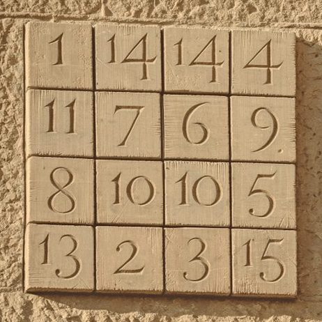

# Alchemy Squares

Antoni Gaudí's spectacular [Sagrada Familia cathedral](https://en.wikipedia.org/wiki/Sagrada_Fam%C3%ADlia) in Barcelona has what is generally billed as a four-by-four "magic square" on the Passion façade in which each row, column and diagonal adds to 33, the age at which Jesus is believed to have died.

In fact, the [formal definition of a magic square](http://mathworld.wolfram.com/MagicSquare.html) of `n x n` dimensions requires that it use each number once, from `1` to `n`2. So it would be impossible to make an actual magic square for Jesus unless he had lived another three years to 36. (Such a square [has been solved](http://www.math.wichita.edu/~richardson/mathematics/magic%20squares/even-ordermagicsquares.html).)

But it's a much more interesting problem to lift the requirement that numbers cannot repeat themselves. Let's call them "alchemy squares." Here's a way to work them out.

## Getting Started
You'll need to [install Node](https://nodejs.org/en/download/). Then just clone this repo and run `	npm install`. It's a lightweight package -- just a few convenience modules.

## Terminology
We're going to use `N` to indicate the value that every column, row and diagonal must sum to, and `K` for the number of squares across and down.

## Sequences
The first step is to generate every unique set of `K` numbers that add up to `N` in every order, allowing for repeated numbers. I wrote an [algorithm](lib/sequences/sequences.js) that generates this fairly efficiently, as well as a [brute-force solution](lib/sequences/sequences_brute_force.js) to check the accuracy. You can test it directly:
	
	node lib/sequences/sequences.js --N=33 --K=4

# More Soon!